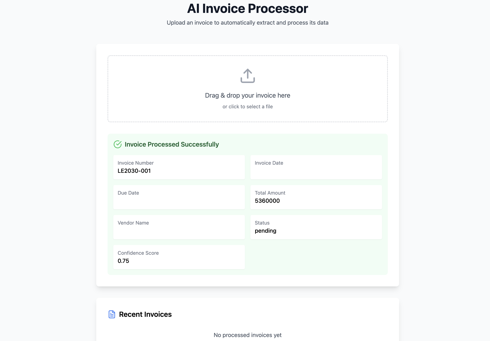

# 🌟 Invoice Processing System – Enterprise Document Automation

A smart, web-based system designed to automate invoice processing for businesses. Users can upload invoice images, and the system uses **OCR (Optical Character Recognition)** combined with **custom text parsing algorithms** to automatically extract key invoice details such as vendor name, invoice number, dates, and total amount. The system delivers real-time feedback, confidence scores, and handles missing or invalid data gracefully.

## Demo

Check out the live demo of the project: [Invoice Processor](https://ai-invoice-processor.vercel.app/)



## 🚀 Features

📸 **Invoice Image Upload**  
- Supports drag-and-drop file uploads for scanned invoices or photographed invoices.

🧠 **Advanced OCR (Optical Character Recognition)**  
- Built using **Tesseract.js** to extract raw text from images.
- Optimized pre-processing for better text clarity and accuracy.

📝 **Smart Data Parsing**  
- Custom regex-based parsing extracts key fields like:
    - Vendor Name
    - Invoice Number
    - Invoice Date & Due Date
    - Total Amount
- Achieved **~75% accuracy** in parsing and field matching.

✅ **Real-time Feedback**  
- Provides immediate display of extracted fields.
- Confidence score shown for transparency.
- Alerts users about any missing or suspicious data.

🎨 **Responsive & Intuitive UI**  
- Built with **React** and **TypeScript**.
- Clean, user-friendly drag-and-drop upload interface.
- Mobile-friendly layout for better usability.

⚠️ **Error Handling**  
- Detects and highlights missing or invalid fields.
- Displays clear error messages to guide users.

---

## 🛠️ Technologies Used

| Technology | Purpose |
|---|---|
| **React** | Frontend framework for building UI |
| **TypeScript** | Static typing for maintainability |
| **Tesseract.js** | OCR engine for text extraction from images |
| **Vite** | Fast development tooling |
| **Tailwind CSS** | Modern styling framework for responsive design |

---

## 📦 Installation & Setup

### 1. Clone the Repository

```bash
git clone https://github.com/your-username/invoice-processing-system.git
```

### 2. Navigate to Project Directory
```bash
cd invoice-processing-system
```

### 3. Install Dependencies
```bash
npm install
```

### 4. Start Development Server
```bash
run dev
```

## 🚀 Usage Guide
1. Open the application in your browser.
2. Upload an invoice image via drag-and-drop or file input.
3. The system will:
    - Extract text using OCR.
    - Parse structured data from the extracted text.
4. Review the extracted fields and confidence score.
5. Correct or fill in any flagged fields (e.g., missing data).
6. Submit the finalized invoice data or export it for further processing.
